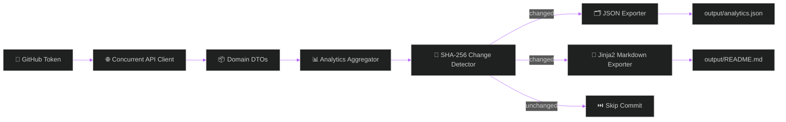

<div align="center">


<br/>

<a href="https://python.org">
  
</a>
<a href="docs/folder_structure.md">
  
</a>
<a href=".github/workflows/devpulse_portfolio.yml">
  
</a>
<a href="#">
  
</a>

<br/><br/>


</div>

<br/>

<p align="center">
<b>DevPulse AI</b> is an automated GitHub portfolio intelligence platform. It inspects developer profiles, calculates deep telemetry &mdash; project health, repository growth, coding trends, developer activity, strategic insights &mdash; generates structured JSON analytics payloads, and renders dynamic Markdown portfolio READMEs using Jinja2 templates.
</p>

<div align="center">


</div>

<br/>

## ⚡ Key Features

<table>
<tr>
<td width="50%" valign="top">

### 🔁 Automation Core
- **GitHub Actions Daily Automation** — cron `0 0 * * *` + manual `workflow_dispatch` triggers
- **Pure Python Change Detector** — SHA-256 content hashing (`devpulse/automation/change_detector.py`) skips redundant commits
- **Concurrent GitHub REST API Client** — multi-threaded language stats via `ThreadPoolExecutor`, retry strategy (`urllib3.util.Retry`), live rate-limit tracking

</td>
<td width="50%" valign="top">

### 🧠 Telemetry & Insights
- 🩺 **Project Health** — active/archived split, license & description coverage %, open issues
- 📈 **Repository Growth** — account age, avg stars/forks, newest/oldest repo
- 💻 **Coding Trends** — primary tech trends, language diversity index
- ⚡ **Developer Activity** — 30-day velocity, most active repo
- 🎯 **Strategic Insights** — maturity level, strongest project, doc completeness score

</td>
</tr>
</table>

<div align="center">


</div>

## 🛰️ Pipeline



<br/>

## 📁 Repository Structure

```text
.
├── .github/
│   └── workflows/
│       └── devpulse_portfolio.yml  # Daily automation workflow
├── config/
│   └── config.yaml                 # Limits, template paths, featured pins
├── devpulse/
│   ├── domain/                     # UserProfile, Repository, Health, Growth, Trends
│   ├── api/                        # Concurrent GitHub REST client + exception hierarchy
│   ├── analytics/                  # Statistical calculator & telemetry aggregator
│   ├── automation/                 # SHA-256 change detector
│   ├── exporters/                  # JSON & Jinja2 Markdown builders
│   ├── services/                   # Pipeline orchestrator
│   ├── config/                     # Env & YAML settings manager
│   └── utils/                      # Logging & safe file I/O
├── templates/
│   └── default_readme.md.j2        # Dynamic Jinja2 portfolio template
├── docs/                           # automation · github_actions · installation · configuration · folder_structure · usage
├── tests/                          # 15 passing unit tests
├── output/
│   ├── analytics.json
│   └── README.md
├── main.py                         # CLI entry point
└── requirements.txt
```

<div align="center">


</div>

## 🚀 Quick Start

**1 · Install**
```bash
cd "d:/Projects/DevPulse AI"
pip install -r requirements.txt
```

**2 · Configure**
```bash
cp .env.example .env
```
```ini
GITHUB_TOKEN=ghp_yourPersonalAccessTokenHere
GITHUB_USERNAME=octocat
```

**3 · Run**
```bash
python main.py --username octocat
```

Generated artifacts land in `output/`:

| File | Description |
|---|---|
| `output/analytics.json` | Structured portfolio analytics telemetry |
| `output/README.md` | Dynamic Markdown README compiled from Jinja2 templates |

<br/>

## 📖 Documentation Suite

| Guide | Covers |
|---|---|
| [Automation](docs/automation.md) | SHA-256 change detector architecture |
| [GitHub Actions](docs/github_actions.md) | Workflow configuration & secrets |
| [Installation](docs/installation.md) | Environment requirements & setup |
| [Configuration](docs/configuration.md) | Env vars & YAML schema reference |
| [Folder Structure](docs/folder_structure.md) | Module boundaries & design patterns |
| [Usage](docs/usage.md) | CLI options, templating, API usage |

## 🧪 Testing

```bash
python -m unittest discover -s tests
```

<div align="center">


<br/>


<sub>Built with 🩶 for developers who'd rather let telemetry write the README.</sub>

</div>
